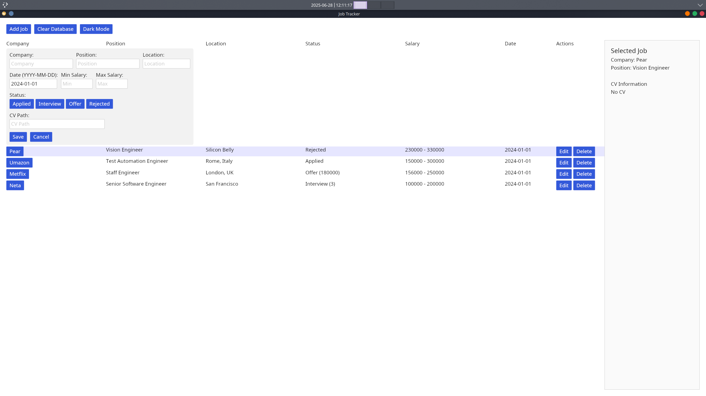
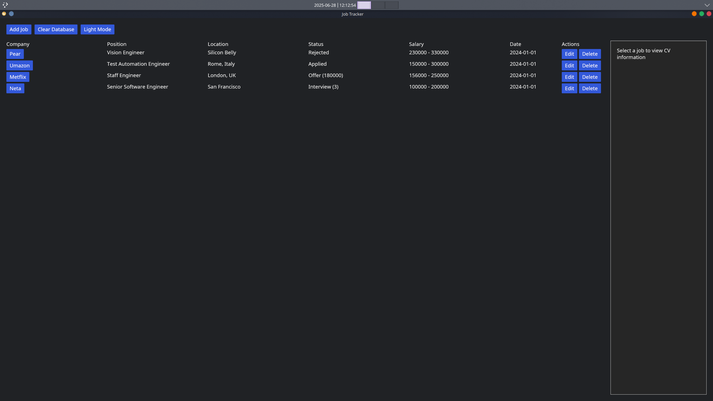

# Job Tracker

[](https://github.com/GiulianoCTRL/job_tracker/actions)
[](https://codecov.io/gh/GiulianoCTRL/job_tracker)
[](LICENSE)
[](https://www.rust-lang.org/)

A desktop application for tracking job applications built with Rust and Iced GUI framework.

## Features

- Track job applications with company, position, location, and salary information
- Multiple status tracking (Applied, Interview, Offer, Rejected)
- Date tracking for applications
- CV/Resume file path management
- Light and dark theme support
- SQLite database for persistent storage
- Search and filter capabilities
- Application statistics and insights
- Docker-based development and CI/CD pipeline
- Cross-platform builds (Linux, Windows, macOS Apple Silicon)

## Screenshots




## Installation

### Pre-built Binaries

Download the latest release for your platform from the [Releases](https://github.com/GiulianoCTRL/job_tracker/releases) page:

- **Linux**: `job_tracker-linux-x86_64`
- **Windows**: `job_tracker-windows-x86_64.exe`
- **macOS Apple Silicon**: `job_tracker-macos-aarch64`

### Quick Install

#### Linux
```bash
wget https://github.com/GiulianoCTRL/job_tracker/releases/latest/download/job_tracker-linux-x86_64
chmod +x job_tracker-linux-x86_64
./job_tracker-linux-x86_64
```

#### macOS (Apple Silicon)
```bash
wget https://github.com/GiulianoCTRL/job_tracker/releases/latest/download/job_tracker-macos-aarch64
chmod +x job_tracker-macos-aarch64
./job_tracker-macos-aarch64
```

#### Windows
Download `job_tracker-windows-x86_64.exe` from the releases page and run it directly.

### Build from Source

#### Prerequisites

- Rust 1.87 or later
- System dependencies:
  - Linux: `gcc`, `libsqlite3-dev`, `pkg-config`, `libssl-dev`
  - macOS: `gcc`,`sqlite3`, `pkg-config`, `openssl` (via Homebrew)
  - Windows: No additional dependencies needed

#### Building

```bash
git clone https://github.com/GiulianoCTRL/job_tracker.git
cd job_tracker
cargo build --release
```

The binary will be available at `target/release/job_tracker` (or `job_tracker.exe` on Windows).

## Usage

### Getting Started

1. Launch the application
2. The database will be automatically created in the `data/` directory
3. Click "Add Job" to create your first job application entry
4. Fill in the job details and save

### Managing Job Applications

- **Add**: Click the "Add Job" button to create a new application
- **Edit**: Click the "Edit" button next to any job application
- **Delete**: Click the "Delete" button to remove an application
- **View**: Click on a company name to view detailed information

### Status Types

- **Applied**: Initial application submitted
- **Interview**: Interview process (specify round number)
- **Offer**: Job offer received (specify amount)
- **Rejected**: Application rejected

### Data Storage

The application uses SQLite for data persistence. The database file is stored at:
- Default: `data/jobs.db`

## Development

### Setting up Development Environment

```bash
git clone https://github.com/GiulianoCTRL/job_tracker.git
cd job_tracker
cargo build
```

### Docker Development Environment

For a consistent development environment that matches CI/CD (uses Rust nightly toolchain):

```bash
# Build and run all CI checks
docker compose build
docker compose up

# Run quick CI validation
./scripts/ci.sh

# Run individual Docker CI steps
docker build -t job_tracker:dev .
docker run --rm -v $PWD:/app job_tracker:dev cargo test
```

### Running Tests

```bash
# Run all tests
cargo test

# Run tests with coverage
cargo install cargo-tarpaulin
cargo tarpaulin --verbose --all-features --workspace --timeout 120

# Run clippy for linting
cargo clippy-all

# Check formatting
cargo fmt -- --check
```

### Project Structure

```
job_tracker/
├── src/
│   ├── main.rs          # Application entry point
│   ├── lib.rs           # Library root
│   ├── db.rs            # Database operations
│   ├── model.rs         # Data models
│   ├── ui.rs            # User interface
│   └── error.rs         # Error handling
├── tests/
│   ├── common/          # Test utilities
│   ├── integration_tests.rs
│   └── test_persistence.rs
├── .github/
│   └── workflows/       # CI/CD workflows
└── Cargo.toml          # Rust dependencies
```

## CI/CD

This project uses GitHub Actions with Rust nightly toolchain and Docker for continuous integration and deployment:

### Workflows

- **CI Pipeline** (`.github/workflows/ci.yml`):
  - Uses local Dockerfile with Rust nightly toolchain for consistent environment
  - Code formatting check with `cargo fmt`
  - Linting with `cargo clippy-all`
  - Unit and integration tests
  - Cross-platform release builds (Linux, Windows, macOS Apple Silicon)
  - Security audit with `cargo-audit`
  - Automatic releases on version tags

- **Code Coverage** (`.github/workflows/coverage.yml`):
  - Docker-based coverage generation with `cargo-tarpaulin`
  - Uses Rust nightly toolchain
  - Uploads to Codecov


### Local Development

To run the same CI checks locally:

```bash
# Using Docker (matches CI environment exactly)
docker compose build
docker compose up

# Or run individual steps
docker build -t job_tracker:ci .
docker run --rm -v $PWD:/app job_tracker:ci cargo fmt -- --check
docker run --rm -v $PWD:/app job_tracker:ci cargo clippy-all
docker run --rm -v $PWD:/app job_tracker:ci cargo test --all-features
docker run --rm -v $PWD:/app job_tracker:ci cargo build --release

# Or use the local CI script
./scripts/ci.sh
```

### Supported Platforms

- Linux x86_64
- Windows x86_64
- macOS aarch64 (Apple Silicon)

### Release Process

1. Update version in `Cargo.toml`
2. Create a git tag: `git tag v1.0.0`
3. Push the tag: `git push origin v1.0.0`
4. GitHub Actions will automatically create releases with binaries for all platforms

## Configuration

### Database Configuration

The application automatically creates the SQLite database if it doesn't exist. No manual setup required.


### Development Workflow

1. Fork the repository
2. Create a feature branch (`git checkout -b feature/amazing-feature`)
3. Make your changes
4. Add tests for new functionality
5. Ensure all CI checks pass locally:
   ```bash
   # Quick local CI check
   ./scripts/ci.sh

   # Or using Docker (matches CI exactly)
   docker compose build && docker compose up
   ```
6. Commit your changes (`git commit -m 'Add amazing feature'`)
7. Push to the branch (`git push origin feature/amazing-feature`)
8. Open a Pull Request

### Code Style

- Follow Rust standard formatting (`cargo fmt`)
- Pass all clippy lints (`cargo clippy-all`) (see .cargo/config.toml for more info)
- Add documentation for public APIs
- Write tests for new functionality

## Roadmap

- [ ] Export to and read from CSV
- [ ] Statistics dashboard
- [ ] Calendar integration

## Performance

The application is designed to be lightweight and efficient:
- SQLite database for fast local operations
- Minimal memory footprint
- Native performance with Rust
- Optimized for thousands of job applications

## Security

- Local data storage (no pesky cloud dependencies)
- SQLite database with file-based permissions
- No network communication required
- Regular security audits with cargo-audit

## License

This project is licensed under the MIT License - see the [LICENSE](LICENSE) file for details.

## Acknowledgments

- Built with [Iced](https://github.com/iced-rs/iced) GUI framework
- Database powered by [SQLx](https://github.com/launchbadge/sqlx)
- Time handling (sort of) with [time](https://github.com/time-rs/time)
- Async runtime by [Tokio](https://github.com/tokio-rs/tokio)

---
